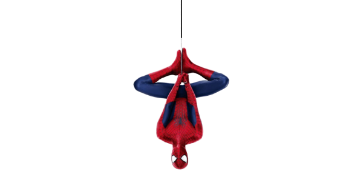

<!-- Pixel Spider-Man -->
<div align="center">



</div>

<!-- Terminal-style header -->
<div align="center">

<picture>
  <source media="(prefers-color-scheme: dark)" srcset="https://readme-typing-svg.demolab.com?font=JetBrains+Mono&weight=700&size=28&duration=3000&pause=1200&color=22C55E&center=true&vCenter=true&width=760&height=70&lines=%24+whoami+-%3E+sarthaksri;%24+./build.sh+--full-stack+--genai;%24+./ship.sh+--always+%E2%9C%A8" />
  
</picture>

</div>

```bash
┌─[sarthak@github]─[~]
└─$ cat about.md

  > Software Engineer
  > Full-Stack · Generative AI
  > Crafting software that quietly makes life easier

┌─[sarthak@github]─[~]
└─$ ps aux | grep hobbies

  ☕  coffee.service     ████████████  always running
  🎮  gaming.service     ████████░░░░  frequently
  🚀  shipping.service   ████████████  perpetually active

┌─[sarthak@github]─[~]
└─$ _
```

<div align="center">

<a href="https://github.com/sarthaksri">
  
</a>

</div>

---

### About me

```ts
const sarthak = {
  role: "Software Engineer",
  focus: ["Full-Stack", "Generative AI"],
  currentlyBuilding: "software that makes life a little easier",
  hobbies: ["☕ coffee", "🎮 gaming", "📦 side projects"],
  funFact: "I read changelogs for fun",
};
```

### Tech I reach for

<div align="center">


</div>

### Contribution snake

<div align="center">

<picture>
  <source media="(prefers-color-scheme: dark)" srcset="https://raw.githubusercontent.com/sarthaksri/sarthaksri/output/github-contribution-grid-snake-dark.svg" />
  
</picture>

</div>

### Let's connect

<div align="center">

<a href="https://www.sarthaksri.xyz/">
  
</a>
<a href="https://www.linkedin.com/in/sarthaksri017">
  
</a>
<a href="mailto:sarthaksri017@gmail.com">
  
</a>

</div>

<div align="center">


</div>
